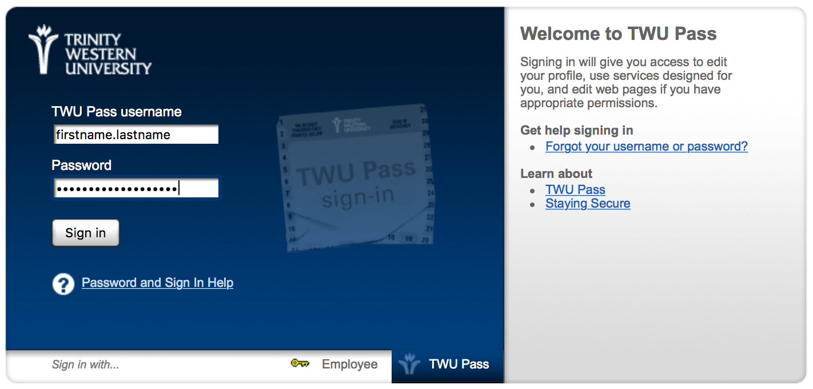

#### About
Moodle is a web platform that allows students and faculty to access a common, secure space to interact in the context of a particular course. Faculty are able to create or upload resources related to the course, distribute information about assignments and supplementary course materials, create and manage quizzes, and host conversations in the forums. Students are able to contact their faculty and each other, submit assignments, respond to discussion prompts, and complete quizzes.

Moodle is one component of TWU's Digital Learning Commons, which also includes [WordPress](https://create.twu.ca), [PressBooks](https://books.twu.ca), and other platforms maintained by individual faculty.

#### Login
Go to [learn.twu.ca](https://learn.twu.ca) and enter your TWUPass credentials.

The next window should give you access to your courses on your Dashboard.

