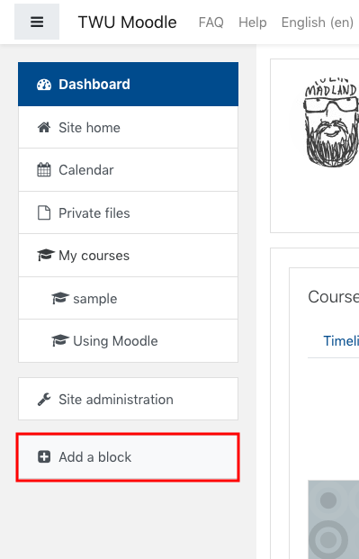

Moodle users have the option of creating a filtered course list to show a condensed list of current courses and replace the 'Course overview' block.

#### Click 'Customize this page' on your Moodle dashboard.

#### Click 'Add a block'.

#### Click 'Filtered course list'.

#### Click the gear icon in the block and choose 'Configure...'

#### Change the line that reads

`shortname | exp | My courses | (FA17)` to `shortname | exp | Spring 2019 | (SP19)` (in future semesters, use the abbreviation for the current semester)

#### Click 'Save changes'.

!!!! Other options:
- Add a second line of code that reads `shortname | collapsed | Upcoming | (SU19)` to show your courses for the upcoming semester, but collapsed under a toggle.
-
