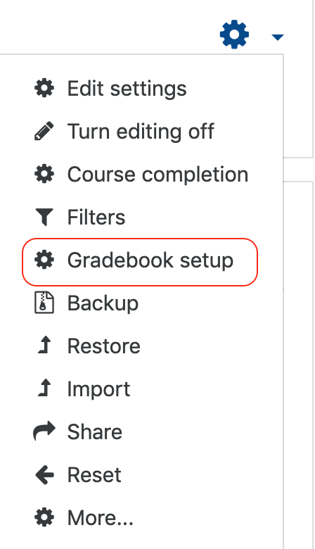
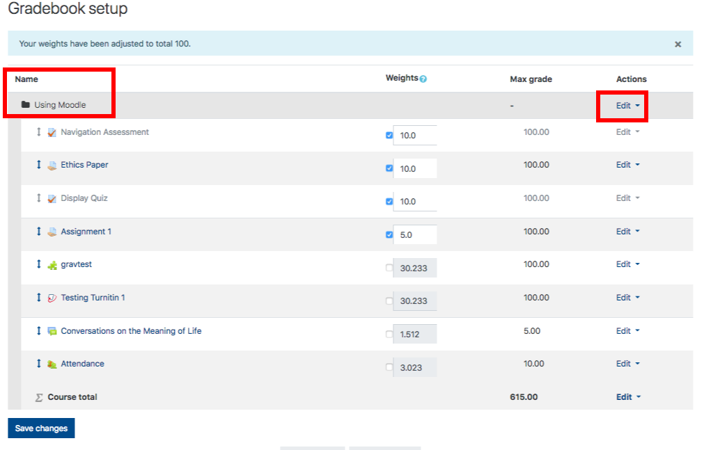
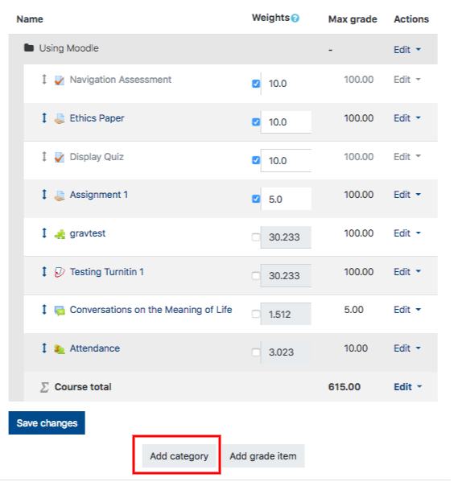
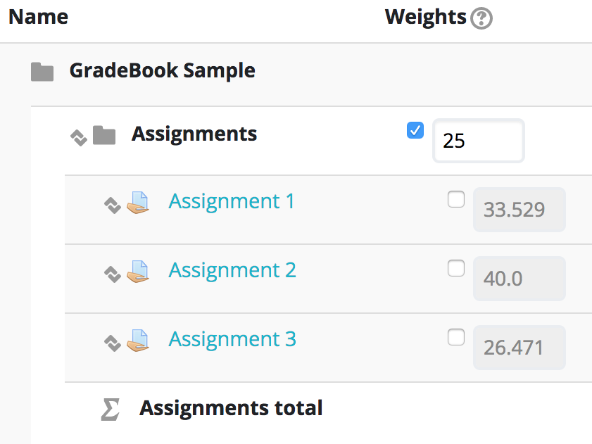
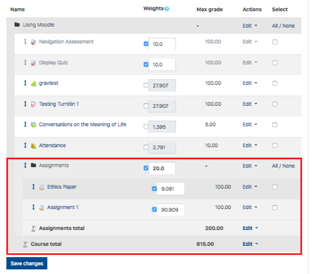

There are four key steps to setting up your gradebook in Moodle.

1. Make sure your aggregation method is set to 'Natural'.
2. Add all of the categories that you need in alignment with your syllabus.
3. Add all of the assignments and manual grade items to their appropriate categories \(see \#2\).
4. Adjust the weights of each of the categories and individual grade items to total 100%.

#### 1. Make sure your aggregation method is set to 'Natural'

##### On your course menu page, select 'Gradebook Setup'.

###### In the top row of the gradebook setup screen under 'Actions' \(it should display the name of your course\), select 'Edit', then 'Edit Settings'.

Be mindful that aggregation is Natural. You have several options to exclude empty grades, chose the grade display type, etc. Once you have selected on the desired settings, scroll to the bottom of the page, and click 'Save Changes'.

**If you have categories already in your course, you may need to set them to 'Natural' as well.**

#### 2.  Create Your Categories

##### At the bottom of your Gradebook Setup page you can select **Add Category**.

Enter a name for the category, such as 'Assignments', or 'Quizzes' or choose a category appropriate for your needs.

_Do not_ create categories for single items in your course such as a final exam or participation grade.

* Click "Show More" for more options such as excluding empty grades, and dropping the lowest grade.
* You will not be able to adjust anything in the 'Category total' section.

Click **Save Changes**

**Be sure to repeat these steps if you need to create more categories in alignment with your syllabus.**

#### 3a. Add _all_ of your Assignments.

Creating an 'Assignment' in Moodle does several things:

* it allows you to communicate the details of each assignment to students, including due dates and the value of the assignment;
* it provides a 'dropbox' for students to submit their work to you;
* it provides a grading workflow for you;
* it creates a column in your gradebook

##### Please see the article '[Creating an Assignment Dropbox](https://twonline.gitbooks.io/moodlefaq/content/creating-an-assignment-dropbox.html)' for instructions.

In the image below, you can see that we've added an 'Assignments' category plus three assignment dropboxes in the course.

Note that the assignments are currently weighted also out of 100%. Do not adjust the weights just yet!

#### 3b. Add _all_ of your manual grade items.

A manual grade item is an assessment that students do not submit through Moodle. It may be an exam grade, or participation, or maybe an in-class presentation.

##### Scroll to the bottom of the page and click 'Add Grade Item'.

* **Give the item a name,**
* **adjust the Maximum grade as necessary,**
* **add the item to the proper category,**
* **click 'Save changes'.**

Now, I have added another category for mid-term exams with two midterms, and a Final Exam. Again, notice the weights are not correct, but Moodle has adjusted them to total 100.

#### 4. Adjust 'Category' weights.

Select the checkboxes for each of the categories and individual manual grade items that constitute your final grade. In the example below, I have chosen the 'Assignments', and 'Mid-term Exams' categories along with the 'Final Exam'.

Set the weights to _exactly_ match your syllabus and total 100.

Note that Moodle will _always_ adjust these weights to total 100.

#### Adjust grade items _within_ each category.

In the example above, the three assignments are weighted within the category according to their 'Max Grade'. To change that, select the checkboxes beside each of them and change their individual weights to total 100.

**The Max grade must be altered in the grade item's settings on the course page. Max grades cannot be altered in Gradebook or grade item Setup**

##### If you add graded items to your gradebook after you have set it up, you will need to adjust the weights again.

#### Other options on this page.

You may also move grade items using the drop down menu in the picture below.

Select the check boxes in the righthand column of each item, scroll down and use the dropdown to move items to a different category.

