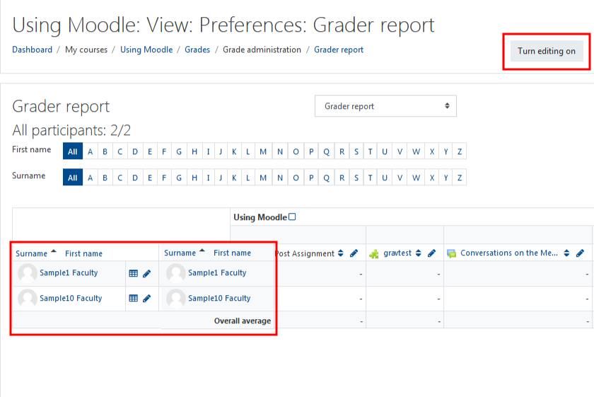

All students grades for your course are located on this page. This is also where you can enter and edit grades.

You can view specific students by using their first name, last name, or both.

#### Turn Editing On

Please note manually enter grades here may cause difficulties in the future as you override certain functions. You can, override grades that have already been entered into the grader report \(through the assignment drop box\) which may be helpful in certain circumstances.

#### Here's an example

Two students are connected to this course. Editing is turned on and we have entered a grade manually. Once your grade book is adequately set up, your course total and overall average will be calculated accurately. Note: All manually entered grades will be highlighted in yellow.

