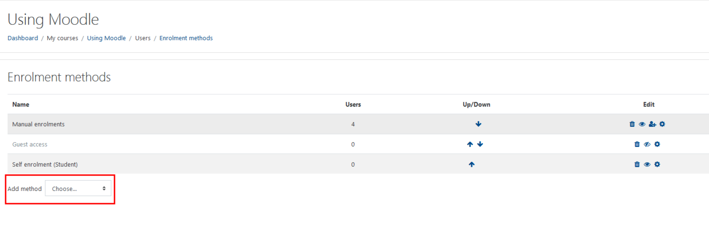
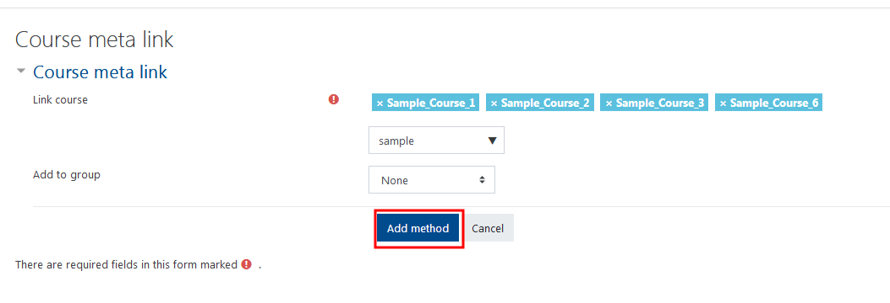

Meta-Courses, **\(formerly known as Parent Courses\)** are your method of amalgamating multiple courses into one location. This is especially helpful when you have multiple courses with the same course content.

#### Sign in to the course you would like to use as the meta-course.

From the list select 'Participants', at the top right hand corner choose the drop down settings, then select 'Enrollment Methods'

#### Click 'Add method', then choose 'Course meta link'.

##### Type the name of the course you want to link and select it in the search box.

You can repeat the search to add more courses.

You have the option of adding the students from each course to their own group in the meta course, but this is typically not necessary.

Click 'Add method'.

##### Congrats! Your Meta-Course is created.

You can now see the new users that have been added, now that you have completed your Meta-course Instructions. This is important to note when creating meta courses as you will want to make sure you keep track and ensure that you have the correct number of users in your course.

##### So, you've made a meta course...

Now that your meta-course is created, students can see the meta-course and the respective courses connected to it. To help everyone avoid confusion seeing multiple courses we encourage you to follow the next instruction. 

#### As a final step, you should hide the child courses to avoid confusion.

In your 'child courses', 'Edit settings', then change the visibility to 'Hide". then save and close.

