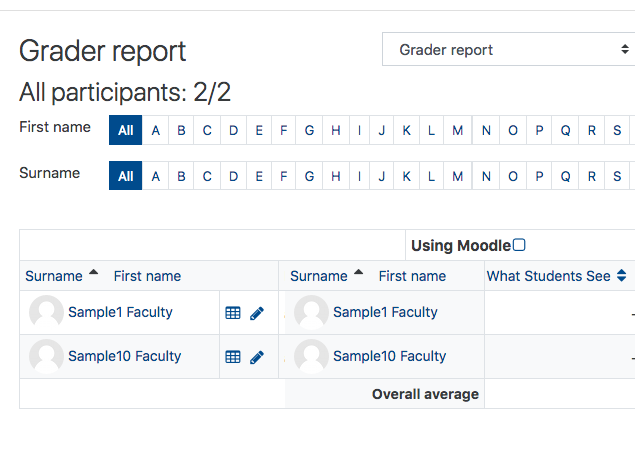

The Moodle Gradebook is a valuable but complex tool. Because of its complexity, we recommend that instructors set up a Gradebook training session for a personalized tutorial. This is especially important for first time users. You can set up an appointment by creating a ticket at the [Helpdesk](https://www.twu.ca/help) or by sending an email to elearning@twu.ca.

#### Basic Details

The Gradebook collects and organizes the grades for the class. It automatically pulls in gradable activities \(e.g. Assignment Dropboxes, Quizzes\) and displays the grades for those activities once you have graded them. The Gradebook will calculate the final grade for each student based on the method you choose; however, ***it does not submit final course grades to the Office of the Registrar***. Using the Gradebook keeps students aware of their progress in the course, motivating them to stay on track.

#### Accessing Gradebook Options

On your course page, on the left menu select **Grades**.

#### NOTE:

There are two views that you will use most often, Gradebook setup and Grader report.

