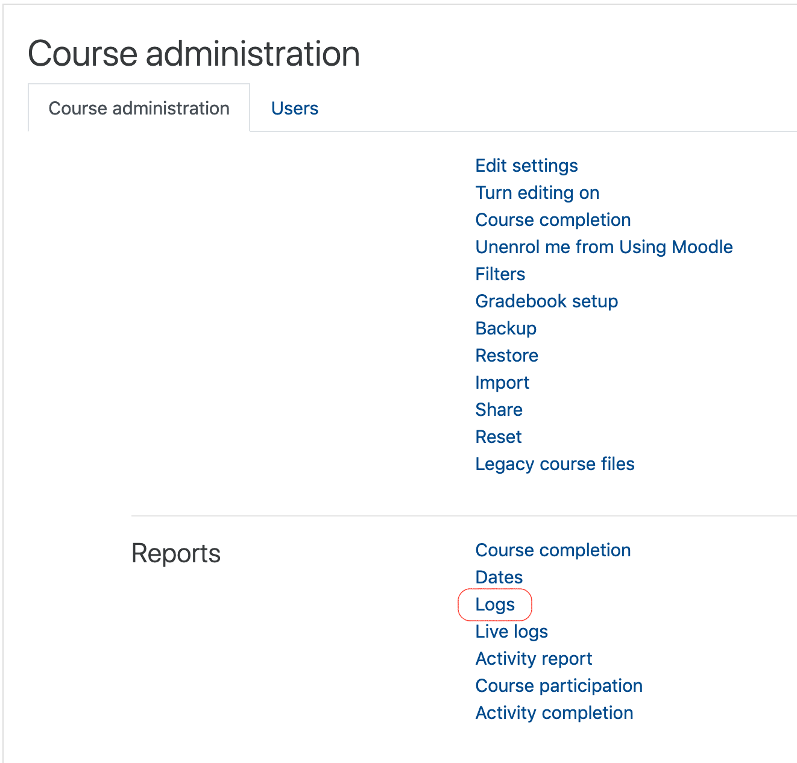
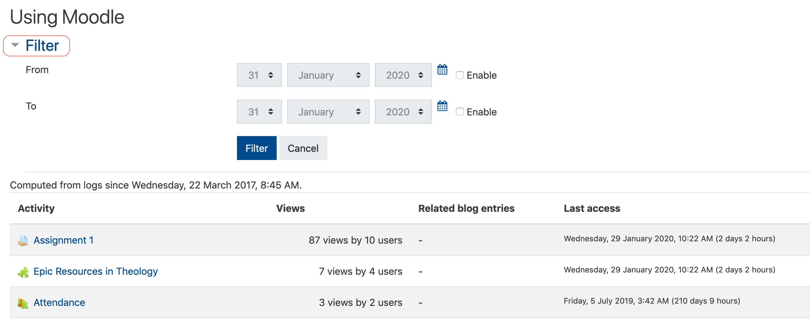

Moodle keeps *very* detailed logs of user activity in the system. Faculty can use this information to help confirm learner activity inside a course as well as track patterns of interaction with learning materials.

# Course logs

### Tap or click the gear in the top right corner of your course and tap 'More'.

### Tap 'Logs'.

### Apply filters.

You are able to filter by participant name, date, activity and others. We recommend that you start with a broader search with fewer filters and narrow your search from there.

### Optional: download the data in CSV format.

At the bottom of each page of entries is an option to download the data as a CSV or MS Excel file. If you choose to do this, you must ensure that the file is stored on a secure drive as it contains private information.

# Activity reports

You may also want to get an overview of all activity in the class.

### Click 'Activity report' on the course administration page.

### Filter accordingly.

