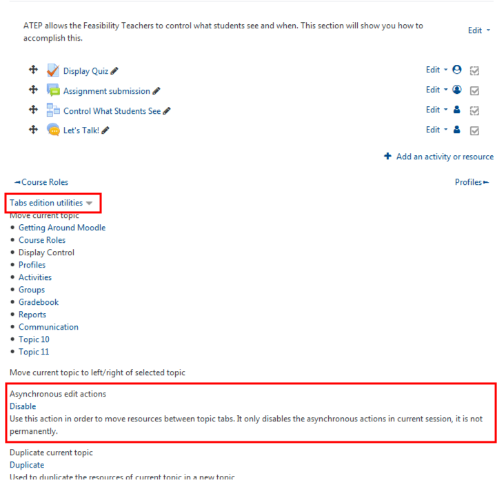
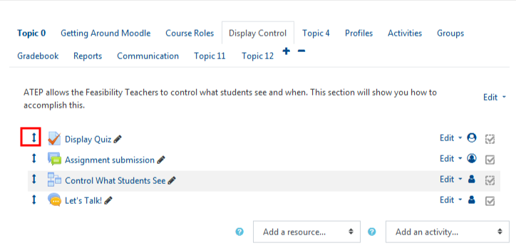

#### Reordering within Sections

When editing anything in Moodle be sure to 'Turn Editing On'. Moving items in sections of Moodle once editing is turn on is pretty easy. Look for the four directional arrow. Once you've selected the item you can drag and drop within the course tab.

Moving across tabs is a bit different.

#### With editing on, scroll to the bottom of the page to 'Tab Edition Utilities', and Disable 'Asynchronous edit actions'.

This alters the icon from being a four directional arrow to a two directional arrow, which allows you to move content cross-sectionally.

You can now arrange content across various tabs. Simply select the content you wish to move and its chosen tab and drop it to the desired space provided.

---

### Moving a whole tab.

- Select the tab you want to move.

- Click 'Tab edition utilities'

- Click on the link of the tab adjacent to where you want to move the tab you selected.

