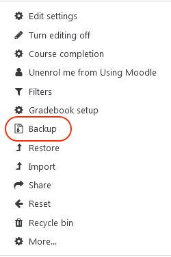
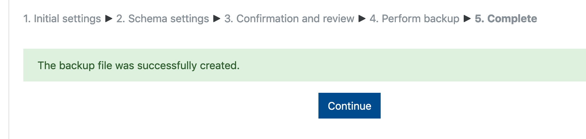
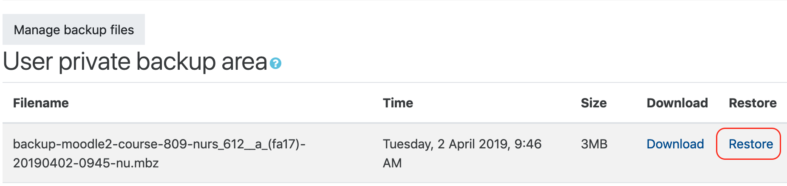
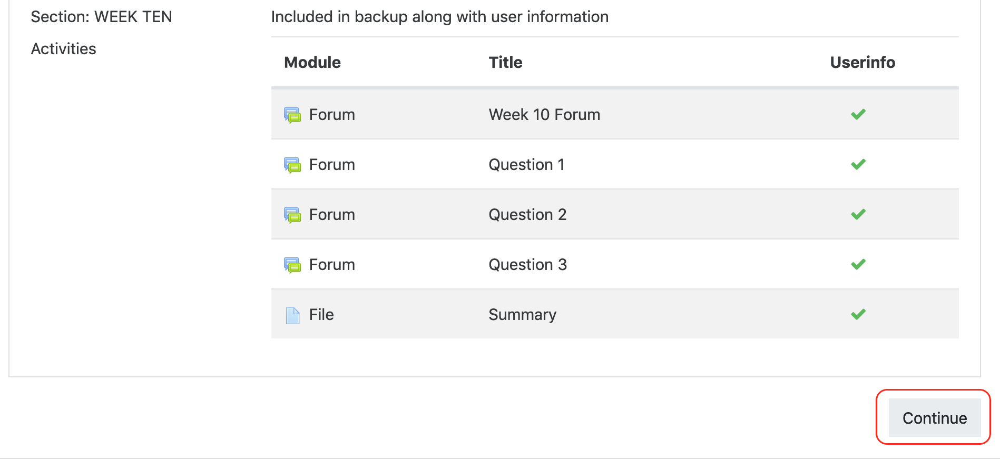
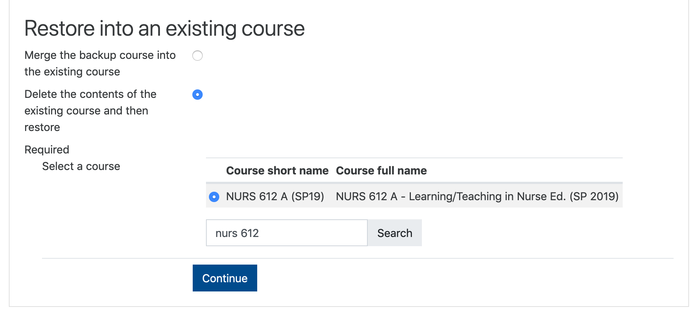
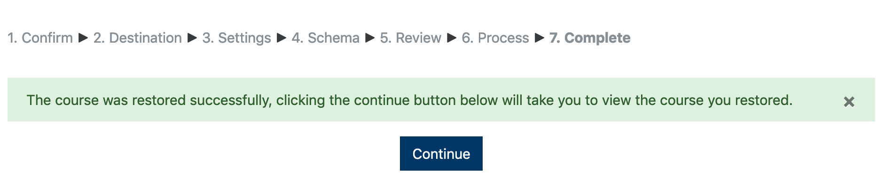

You can use this `Backup and Restore` process to overwrite the contents of a course. This is useful if you imported the wrong course materials, or duplicated them.

##### Start in the `Source` course site (usually a previous site).

##### Access the 'Actions' option at the top right hand corner of your course.

##### Select 'Backup' from the drop down menu.

##### Deselect `Include enrolled users` then scroll down and click `Jump to final step`

##### Let Moodle do its thing...

##### ...click `Continue`

##### You will be taken to the `Restore course` page. Click `Restore` beside the backup file you just created.

##### Scroll to the bottom of the page and click `Continue`.

##### Scroll down to `Restore into existing course` and choose `Delete the contents of the existing course and then restore`

!!!! You may have to search for your course using the window below, select the `Destination` course, and click `Continue`.

##### Deselect `Include enrolled users`, then scroll down and click `Next`.

##### Leave the `Course settings` as the are, scroll down and click `Next`.
!!!! You may deselect items that you don't want in the destination course on this page.

##### Scroll down and click `Perform restore`.

##### Click `Continue` to go to your course.

! Don't forget to update your syllabus and assignment dues dates!
