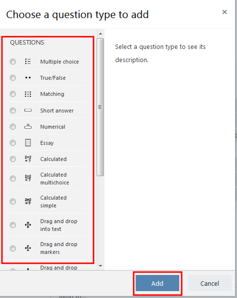
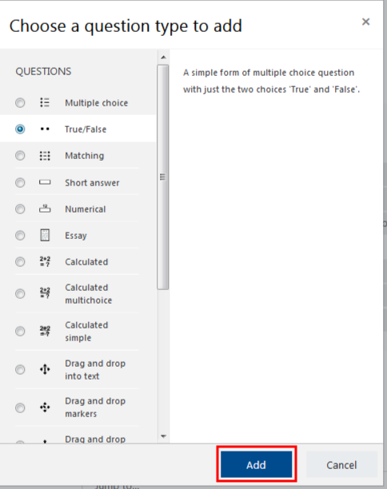

Moodle 3 allows quizzes to be created within a course, instead of imported from an external source. Quizzes are a useful tool that can be utilized for many different purposes, and in many different formats. To learn more about how to create a quiz on MyCourses, follow this instructions below.

#### Part 1: Creating a Quiz

**Turn editing on** in the top right hand corner.

Scroll to the section in which you would like to create a quiz; click on the **Add an activity or resource** button, select **Quiz** from the pop-up window, then click **Add**.

Next, you will be automatically redirected to the quiz creation page.

Supply a name for your quiz, and enter a description if you wish.

#### Other options to utilize.

There are several options that can be utilized in the creation of your quiz. For example, the **Timing** options allow you to set a start and end date for quiz availability, as well as to set a time limit. The **Grade** options allow you to set a limit on allowed attempts.

You can set the peremeters for the quiz using the options listed below the **General** option.

**If you are uncertain about a quiz option, click on the question mark symbol next to each setting to learn more.**

Once you have adjusted the settings as desired, click **Save and display**.

Remember that you can edit your quiz name and settings at any time by returning to the course home page, clicking on the **Edit** dropdown list next to your quiz, and selecting **Edit settings**.

#### Part 2: Adding Questions to a Quiz

In the top right hand corner select the settings gear for its drop down menu, select **Edit quiz**. This will take you to your **Quiz bank**.

On the **Editing Quiz** page, choose **Add**, and select **+ a new question**.

A list of question types will be provided in a pop-up window. Each type of question works in a specific way; click on each one to learn more about it. Feel free to explore which question option is right for you.

**Note:** If you use options such as...

**Short Answer**

students have to type in the exact answer that you have created in order to be graded correctly. For this reason, short answer questions may work best for one or two word answers. Essay questions can be utilized, but must be marked manually.

#### Once you have selected your option. \(Our example uses the True/False Question\)

Once you have selected a question type, you will be redirected to the question creation page for that specific question.

Select **Default for \*quiz name\*** from the **Category** dropdown menu.

Provide a name for your question, such as Question 1 so it can be tracked within its category. Each question is allotted a number by the system and as a result the Question name is only used for tracking purposes within the question bank.

Provide text for your question, such as:

#### Give your question a point value by typing in the "Default points" box.

You can choose to provide general feedback to students which will be displayed once they have completed the question.

#### \*For creating a Multiple Choice Question\*

There are several "Choice" options that you can create for the question. Fill in the first possible answer in the "Choice 1" box. If it is the correct answer, select "100%" from the "Grade" dropdown menu. If it is not the correct answer, select "None" from the "Grade" dropdown menu. If you chose "Multiple answer allowed" from the dropdown menu, make sure you select the appropriate grade breakdown for how much the particular "Choice" is worth.

The "Feedback" box allows you to provide feedback to a particular question if desired. For example; "Incorrect. See 'Chapter 2' for more information on this question." After you have added all of the appropriate settings for "Choice 1," move on to "Choice 2" and follow the same instructions as for "Choice 1." Continue until you have filled in all of the possible answers that you would like to provide for this particular question.

#### Once you have completed entering the information for your question "Save changes".

**Once you are back on the Question Bank page, you can make a few alterations if needed.**

**You can edit the quiz heading here.** **You can rearrange the position the question appear if you don't wish for them to be shuffled.** **By clicking on this you can place page breaks between desired questions.** **"Shuffle" can be turned on or off; this options makes the provided answer options appear in a different order for each student.** **You may add additional questions.** **You can Preview or Delete the question.** **Enter the maximum mark here.**

\*Note: You may add as many questions to a quiz as you would like. You are also able to preview your quiz to have a sneak peak of what your quiz will look like to students. Go to your Administration block and select "**Preview**". If you need to edit further after previewing your quiz, open the quiz and select "**Edit Quiz**" in your Administration block.
