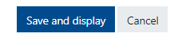

The start and end dates affect which courses are in the "Future", "Past", and "In Process" tabs on Moodle.

##### Click on the gear in the top right corner and click "Edit Settings."

##### Edit the end date.

##### Click Save and Display.

- The start date will be set automatically to the first of the month prior to the beginning of class.
- As the instructor, you will have access to the course as soon as the course is created, about 6 weeks before the end of the previous semester.
- Courses are [now] set to be current for 120 days which will cover a full semester plus the exam period.
- Students can still access the course in the 'Past' tab on their Moodle Dashboard after the course has ended.
