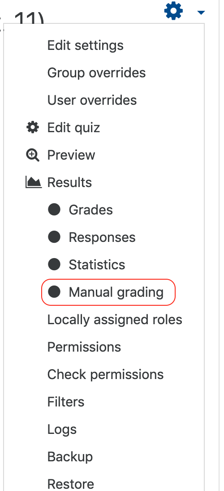

If you quiz contains items that cannot be graded automagically, you will have to grade those items manually.

If your quiz contains a mixture of auto-graded and manually graded items, learners will not receive any feedback until you have completed the manual grading.

### Grading all responses to a short or long answer quiz

Click the title of the quiz.

#### From the 'Actions' menu, select 'Manual grading'.

#### Click 'Grade all'.

You can change the number of attempts shown at the top of the page. Be careful, though, fewer attempts per page means you lose less if something goes sideways.

#### You may review the answer in this window. Mark the answer by commenting and submitting a grade and 'Save and go to the next page'.

You can review the grades in [Grader Report](https://twonline.gitbook.io/moodlefaq/gradebook/grader-report).
