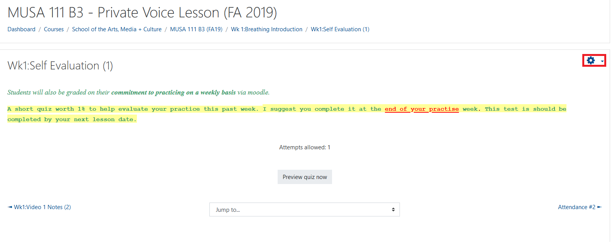
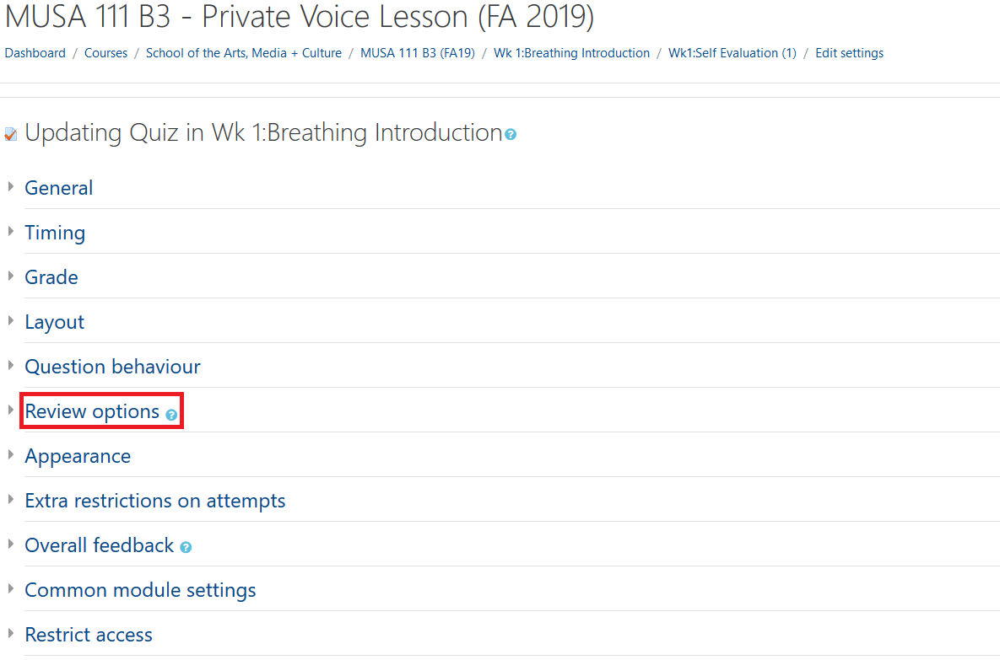
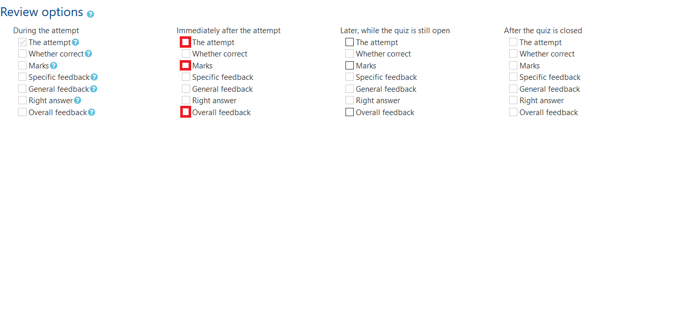

### These are the steps that should be used to show or hide marks for a quiz in Moodle.

### Go to the quiz the that your seeking to change.

### Click on the name and/or topic your seeking to change.

### Click on the "Settings Icon" in the top right corner.

### Select "Edit Settings"

### Click on "Review Options"

### Select "The Attempt", "Marks",and "Overall Feedback"

### Select "Save and Display"
