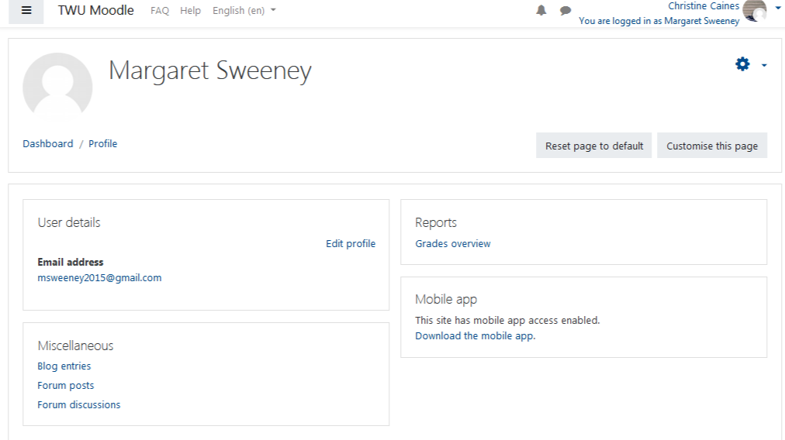

#### Log onto Moodle and click your name in the top right hand corner of the screen.

#### Scroll down through the menu options and select "Profile".

#### Select "Edit profile" on the left side of the screen.

#### Enter new information.

#### After editing, feel free to click "update profile".
