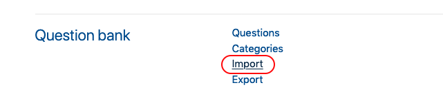
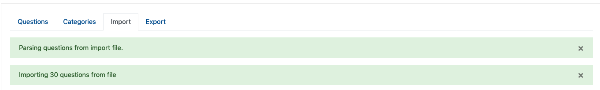

#### Click 'More' under the gear menu in the source course.

#### Click 'Export'

#### Select 'Moodle XML format' and the category of questions (this should match the title of the quiz) you want to export and click 'Export questions to file'

If you get a popup after this step asking you what to do with the file, save it to your desktop (or a more secure spot if you prefer).

#### Click 'Continue'

#### Navigate to the destination course, click the gear, and choose 'More' again.

#### Click 'Import'

#### Choose 'Moodle XML format', upload the file you just downloaded (it will start with the word 'questions'), and click 'Import'.

#### You should see confirmation of success.

!!! You can also use this import option to import quizzes and questions from publisher materials like test banks.
