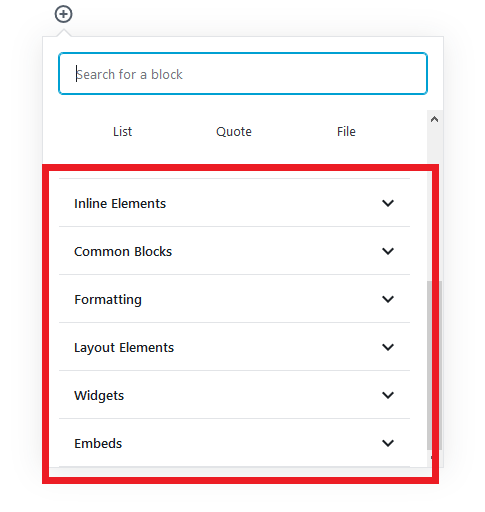
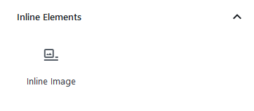

In order to add new blocks to your post, click the +Plus icon and select the type of block you wish to add. Blocks will be divided into sections, at the top you will find the **Most Used** blocks:

If you scroll down, you will see the different sections in which blocks are categorized:

- **Inline Elements** - Inline image

- **Common blocks** - Paragraph, Cover, Image, Heading, Gallery, Audio, List, Quote, FIle, Video.

- **Formatting** - Code, Classic Editor, Custom HTML, Preformatted, Pullquote, Table, Verse.

- **Layout Elements** - Button, Columns, Media & Text, Page Break, Separator, Spacer, More.

- **Widgets** - Short Code, Archives, Categories, Latest Comments, Latest Posts.

- **Embeds** - Embed content from Youtube, Spotify, Facebook, Twitter, Instagram, etc.

