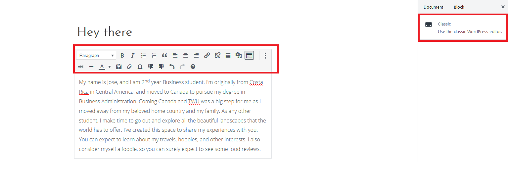
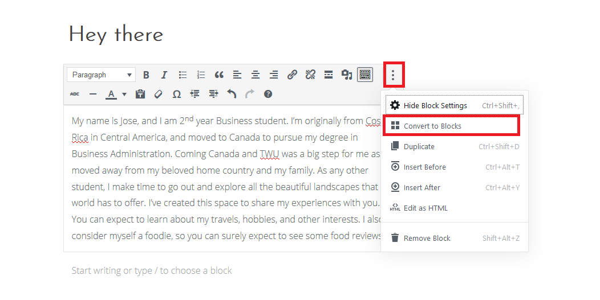

Your old content will not disappear! However, the experience is a little bid different. The block editor will put all the old content into a single **Classic Block**. The Classic block is basically the old TinyMCE editor, but embedded inside the new editor.

To work with your old content you can:
- Leave it as a Classic block and edit it like in the old editor
- Use the **Three dots** icon and select **Convert to Blocks**. This will break it into individual blocks and you'll be able to edit it with the new block editor.

Once you're finished, click the **Publish** button.
