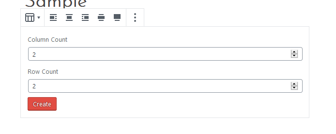
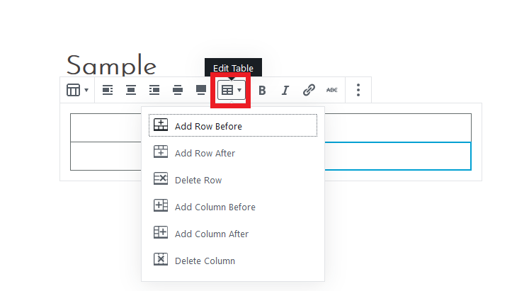

#### You can create tables using the block editor. Click on the **+** icon to add a new block. Choose **Table** under the **Formatting** category.

#### Choose the number of rows and columns for your table, then click the **Create** button.

#### If you wish to delete or add more rows/columns, click the **Edit table** icon and select to add or delete rows/columns.

