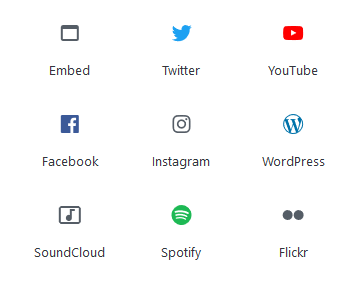

#### You can embed content from other websites. To do so, simply click the **+** icon to add a new block, then select any from the **Embeds** category.

#### Once you have selected the type of content you want to embed, enter the URL and click the **Embed** button.

#### Once you're finished, click the **Publish** button.
