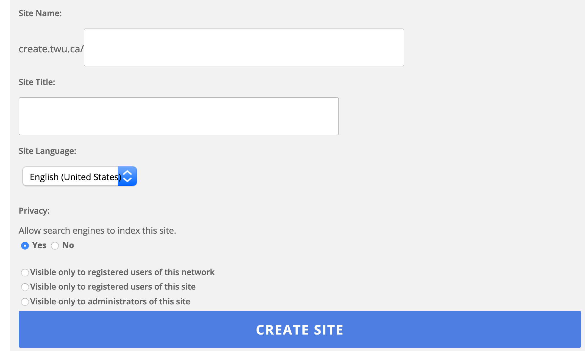
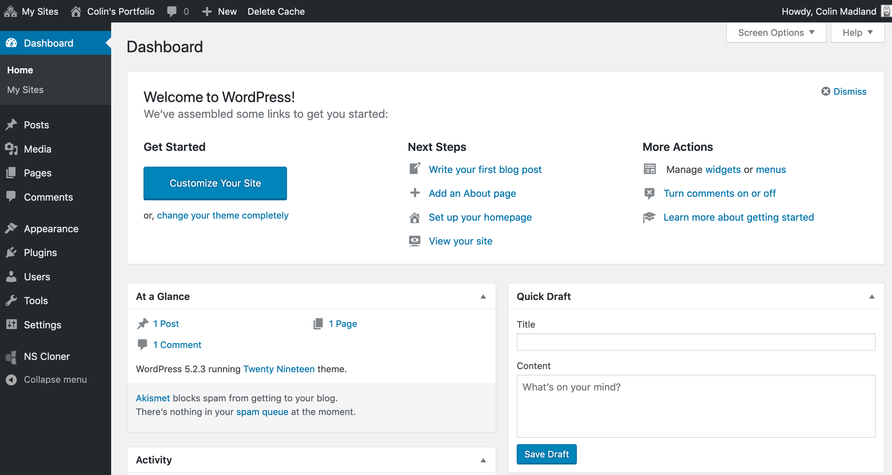

If you do not have a portfolio site of your own, please follow these instructions.

If you already have a site, skip to the next step by tapping the arrow on the right side of the page.

# Sign in to WordPress

### Go to [https://create.twu.ca](https://create.twu.ca)

### Tap 'Log in'

# Tap 'My Sites' then 'Add New'

# Enter the required information.

- your site URL (cannot be changed)  
! Lower-case letters, numbers, and hyphens ONLY!
- a site title (this can be changed later)
- Choose your privacy settings
- Tap 'CREATE SITE'

# Click 'Log in'

# You will see the Dashboard of your new site!

# Activate 2 Plugins...

Click the arrow on the right side of this page to learn how.
