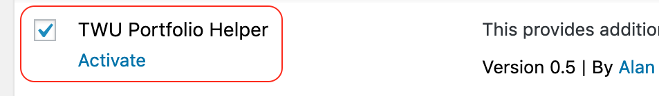
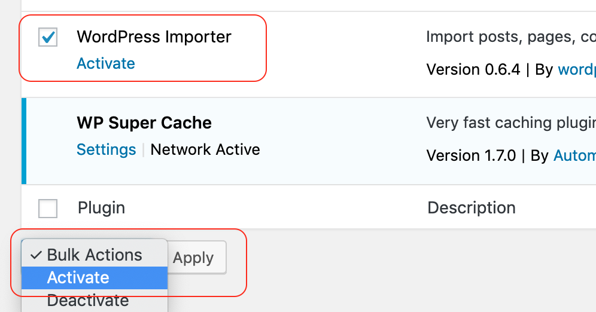

# Tap 'Plugins'

# Scroll to the bottom of the list

- select 'TWU Portfolio Helper' and 'WordPress Importer'
- at the bottom of the page, click the dropdown menu and choose 'Activate'
- tap 'Apply'

# Activate a TWU Theme...

Click the right arrow on this page.
