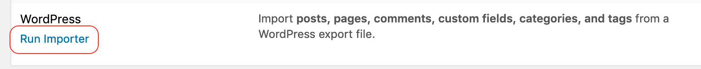
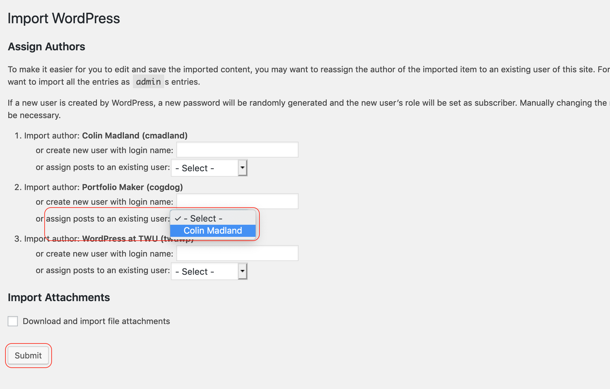

The next step will give you the structure you need to make sense of the instructions in FNDN101.

# Sign in to FNDN101 1 in [Moodle](https://learn.twu.ca)

- Tap 'WordPress Fix' and SAVE the file to your desktop or somewhere else you can easily find it.  
!! Do not open or edit the file!  

This will download a file called `twuportfoliofix.xml`.

# In WordPress, hover over 'Tools' and tap 'Import'

!!!! The following steps will ADD some things to your site. Nothing will be deleted.

# Tap 'Run Importer' under 'WordPress'

- Tap 'Browse'

- choose the `twuportfoliofix.xml` file
- tap 'Upload file and import'

# Assign authors

- use the dropdown menus to choose your own username as author on all three 'Import Authors'
- select 'Download and import file attachments'
- tap 'Submit'

You should see a message to 'Have fun!'

# Check your menus...

Click the arrow on the right side of this page.
