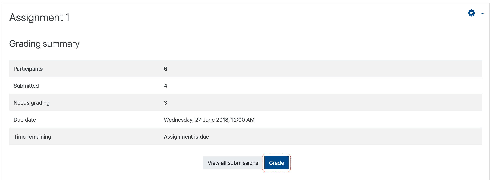
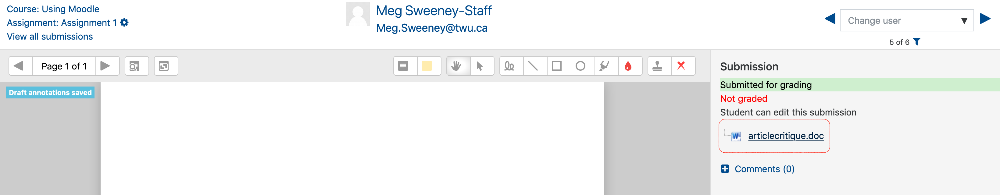
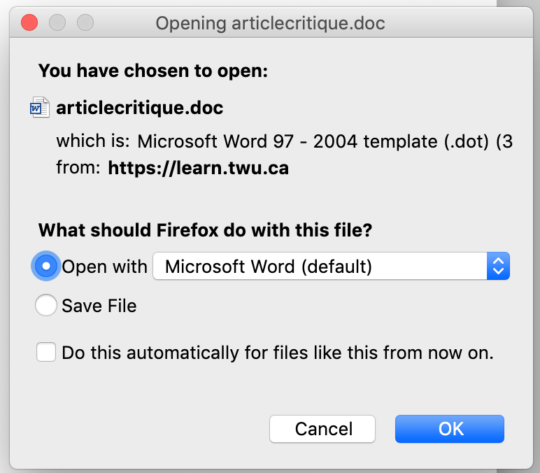
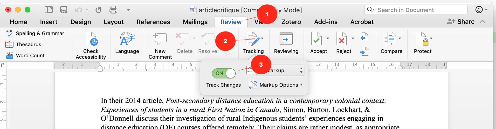
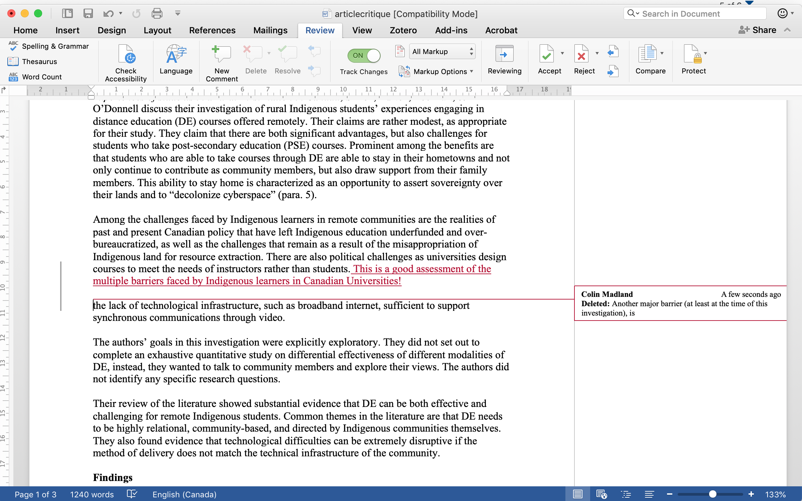
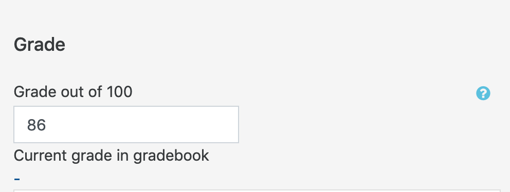
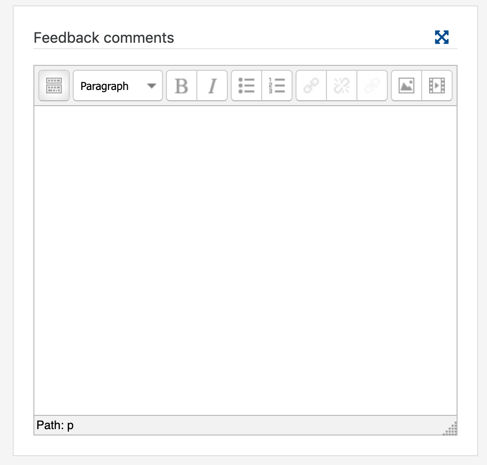
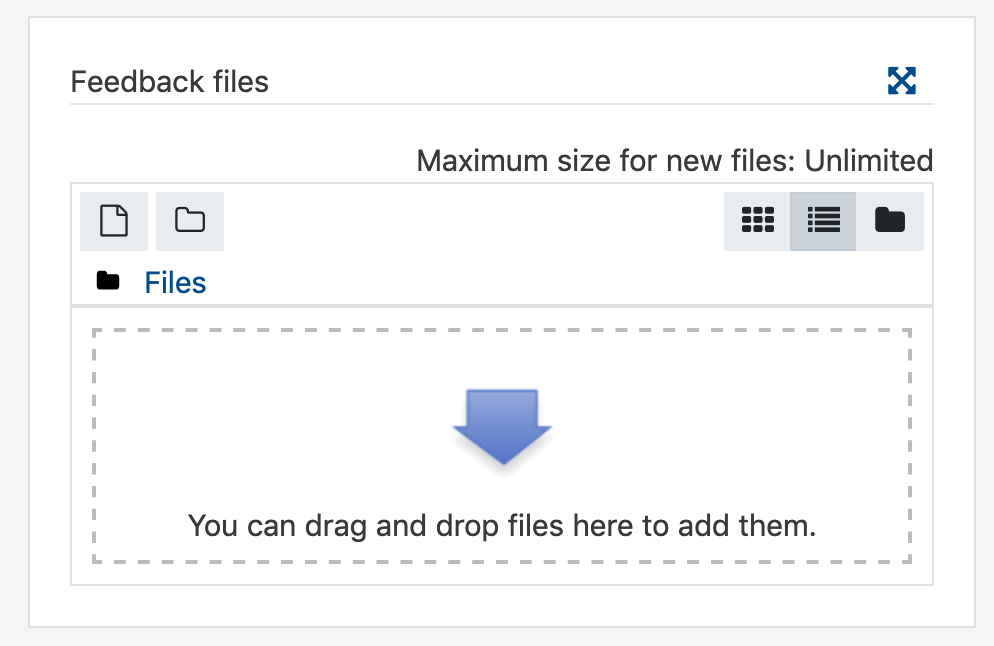

#### 1. Click the assignment link.

#### 2.  Click 'Grade'.

#### 3.  Click the link to the submitted document.

#### 4.  Open the file from the dialog box or your 'Downloads' folder.

#### 5. Turn on 'Track Changes' in MS Word to enter your comments and feedback.

#### 5.  Save the graded file with a new file name to your computer.

#### 6.  Enter the student's numeric grade into the 'Grade out of ###' field.

#### 7.  Enter comments in the 'Feedback comments' field \(optional\).

#### 8. Drag the graded file to the 'Feedback files' window in Moodle, or click the blue arrow to find the file on your computer.

#### 9. Click 'Save changes' or 'Save and show next' to send your feedback to the student.

