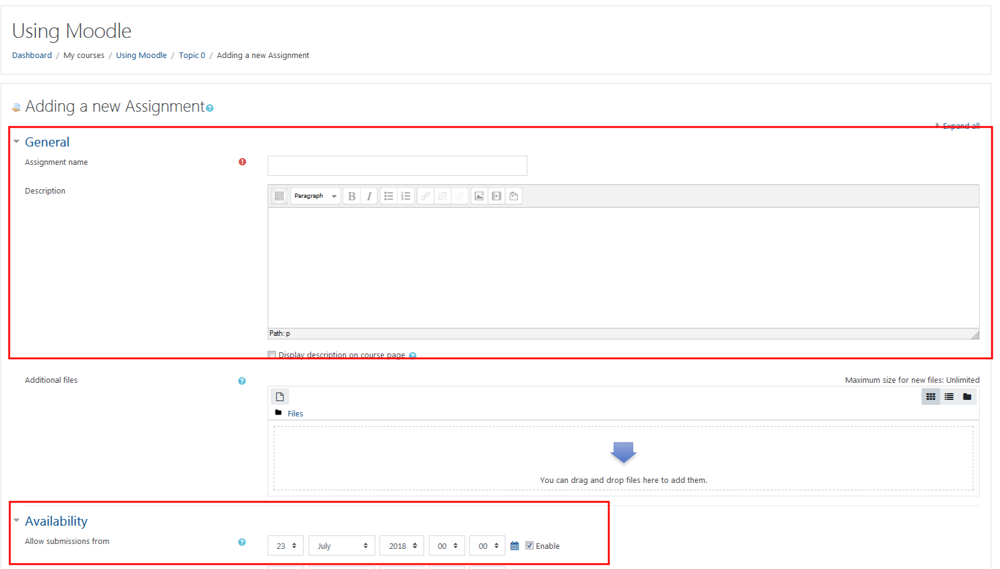

The most commonly used activities, Assignment Dropboxes allow students to submit assignments online. This is convenient for Instructors, as it eliminates the possibility of losing a student’s paper and as it enables students to submit their assignments immediately. It also connects to gradebook so students can see their grades once they are corrected.

#### Click the 'Actions' icon in the top, right corner and turn editing on.

#### Click 'Add an activity of resource' at the bottom of the topic.

#### Choose 'Assignment'.

Then click "**Add**" at the bottom of the window.

#### Enter a name for the assignment and add the assignment details in the description.
- This is where you should publish the details and requirements of the assignment.
- You may also add any necessary attachments as well.
  - Attachments might include datasets, example submissions, or other resources that students need to complete the assignment.
- Adjust the 'Availability' settings.

#### Click the 'Grade' toggle to edit the maximum grade.

>>>> If your assignment is graded on a Pass/Fail basis, choose 'Scale' for the 'Type', then use the 'Fail/Pass' scale.

#### Change the maximum grade to align with your marking rubric.

>>>>> If you want to edit the maximum grade later, you must do it from the assignment, not 'Gradebook settings'.

##### Optional: You may also add the assignment to the appropriate 'Grade category' using the dropdown menu.

>>>>> You can change the grade category later in 'Gradebook settings'.

#### Other options for your assignment dropbox.

You may set the parameters for your assignment dropbox using the following options. You can set the due date and cut off date, submission type, add the max grade and assign it to a category in your gradebook, etc.

Once options are selected click **Save and return to course or display** to preview your drop box.

>>>> You must select a time from the 24 hour clock, it is often convenient to make an assignment due at 23:55, or 11:55PM, on the date that it is due to avoid due date mix ups for students.
