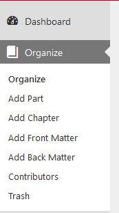
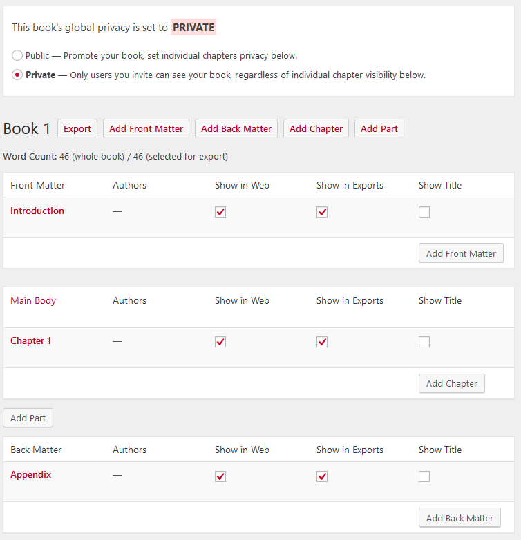

You can organize your book according to your desired structure. To do so, go to **Dashboard** and click on **Organize**. Here you will be able to add multiple elements to your book, including:

- Front Matter:
  - Abstract
  - Acknowledgements
  - Before Title Page
  - Chronology, Timeline
  - Dedication
  - Disclaimer
  - Epigraph
  - Foreword
  - Genealogy, Family Tree
  - Image Credits
  - Introduction
  - List of Abbreviations
  - List of Characters
  - List of Illustrations
  - List of Tables
  - Miscellaneous
  - Other Books by Author
  - Preface
  - Prologue
  - Recommended Citation
  - Title Page

- Back Matter:
  - About the Author
  - About the Publisher
  - Acknowledgements
  - Afterword
  - Appendix
  - Author's Note
  - Back of Book Ad
  - Bibliography
  - Biographical Note
  - Colophon
  - Conclusion
  - Credits
  - Dedication
  - Epilogue
  - Glossary
  - Index
  - Miscellaneous
  - Notes
  - Other Books by Author
  - Permissions
  - Reading Group Guide
  - Resources
  - Sources
  - Suggested Reading

- Chapters:
  - Numberless
  - Standard

You have the option to make your book available to the **Public** or keep it **Private**

