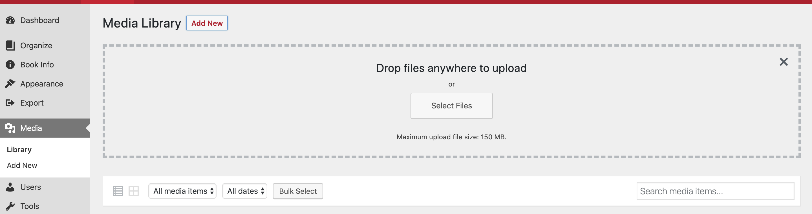
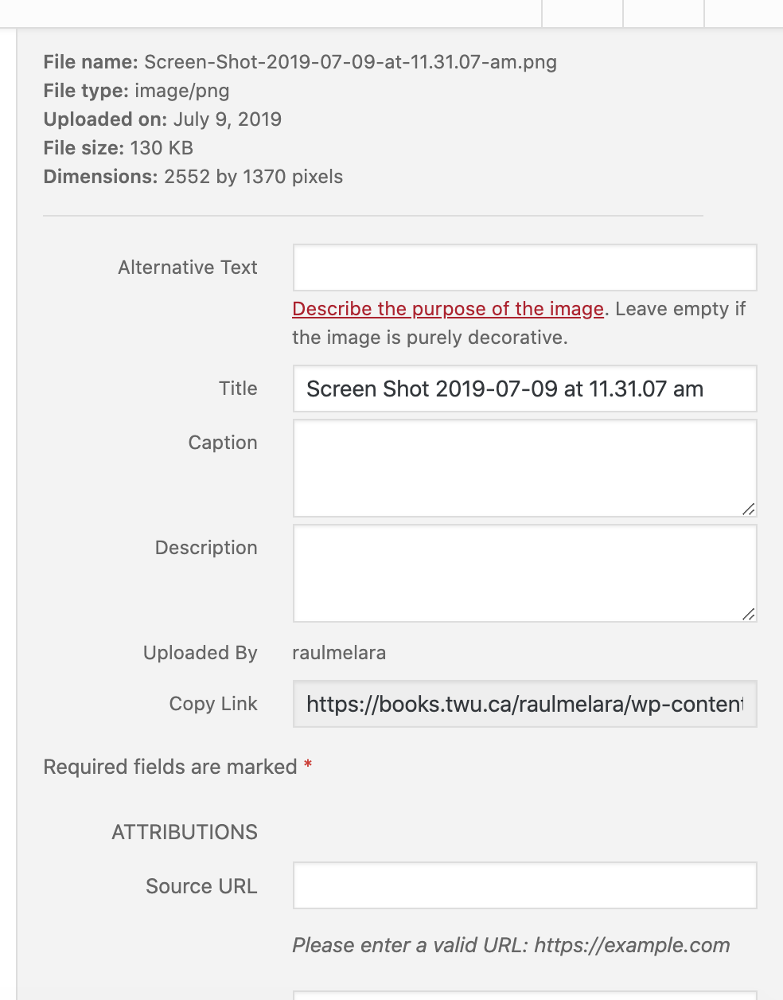

You can add a media library by clicking on **"Media"** on the menu. To add new media, click the **"Add New"** button.

Then click **"Select Files"** or drag the file. Once the file is uploaded, it will appear on the section below.

Click the file in order to add a title or description.

