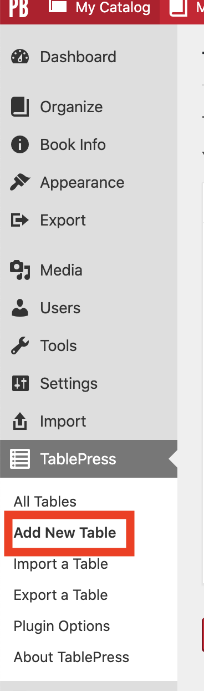

You can add tables to your book. Click on **"PressTables"** on the menu on the left. Select **"Add New Table"**

Enter the a name and description for the table. Select the number of rows and columns.

Click the **"Add Table"** button.

Click on any cell to enter content.

You may use the **"Table Manipulation"** menu to insert links and images, merge, hide, show, insert, delete or duplicate cells, as well as adding or deleting rows and columns.
