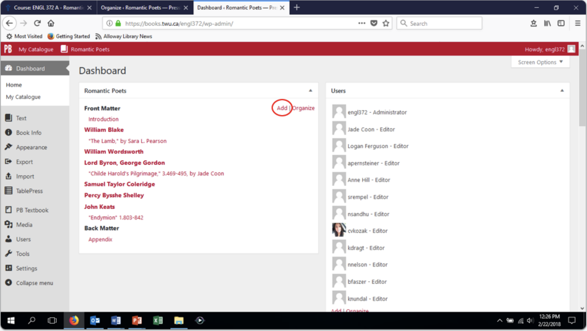
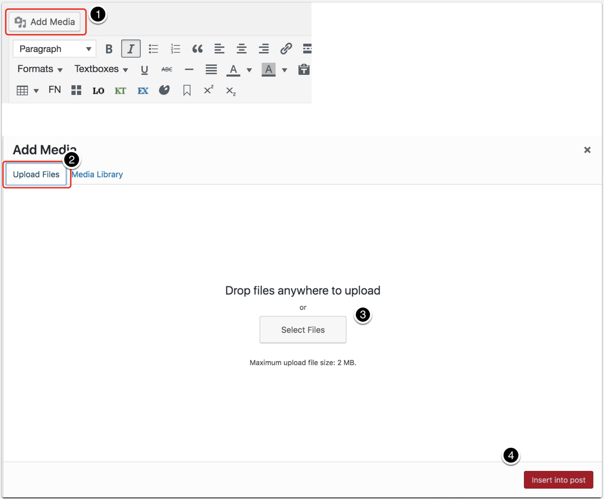

## Getting Help
Don’t get frustrated, get help! Email Colin Madland, TWU’s online learning and instructional technologies expert, to get help with how to use PressBooks: colin.madland@twu.ca. You can also make an appointment with him as a group, or individually, for some tutoring in using PressBooks. Please also feel free to email me, since I’ve gone through the experience of researching, writing, and setting up a page for Blake’s “The Lamb”: sara.pearson@twu.ca.

## Go to books.twu.ca.
Sign in with the username and password that were emailed to you.

## Create your Chapter
From your Dashboard, click **"Add"**.

## Add Chapter details.

1. Enter the title of your poem and the line numbers you will discuss (see Jade's for an example.)

2. Choose the appropriate **"Part"** (author) for your poem.

3. Enter your content here. You can either compose your work directly in PressBooks (it will auto-save as you go), or you can copy and paste from MS Word.

4. Click **"Publish"** to publish your work to PressBooks. You may also save your work as a draft and return to it later.

To insert a footnote, click the **"FN"** in the editor and type your footnote in the box that appears. Feel free to experiment with the **"LO,"** **"KT,"** and **"EX"** buttons to add highlights to your text.

## Works Cited

To create the hanging indent essential for your Works Cited list, select everything in the Works Cited list, and then in the editor, pull down the **“Formats”** menu and choose **“Hanging Indent.”**

## Adding Media

Place your cursor on the page where you want the image to appear.

1. Click **'Add Media” above the editor.**

2. Click **"Upload Files."**

3. Drop a file (audio, image) into the “drop files here” box, or click **"Select Files."** Your file must be less than 2MB.

4. Click **"Insert into post."**

