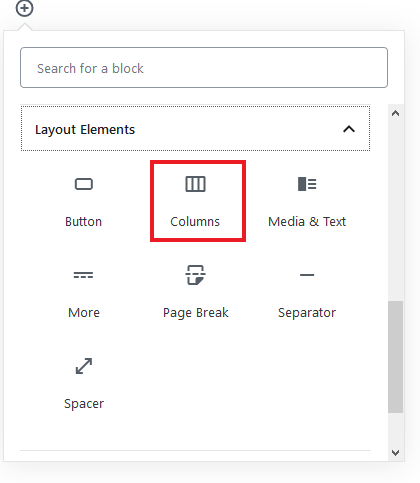
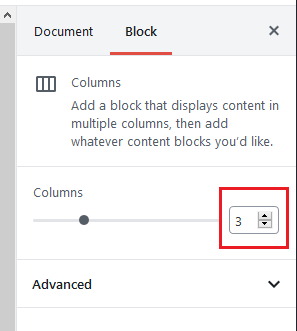

#### The block editor includes a feature that allows you to create different columns. All you need to do is to add the **Columns** block from the **Layout Elements** category.

#### You can also insert other blocks inside it.

#### You can increase or reduce the number of columns by changing the number in the **Block** settings tab

#### Once you're finished, click the **Publish** button.
