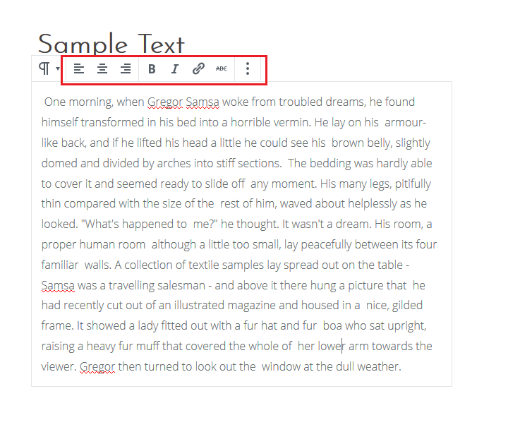
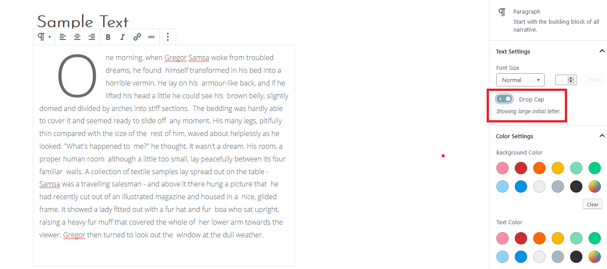

#### You can control the content in the body editor. You can also control the styling of the text by using the menu bar that appears when you hover over a block.

#### For more advanced styling, you can use the **Block** settings tab to change the font size, text and background color.

#### You can also make the first letter of the text a large initial letter by activating the **Drop Cap** feature in the **Block** settings tab.

#### Once you're finished, click the **Publish** button.
