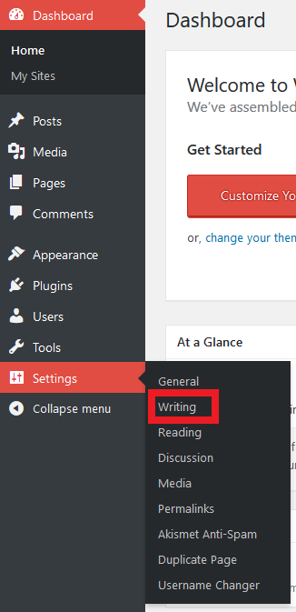
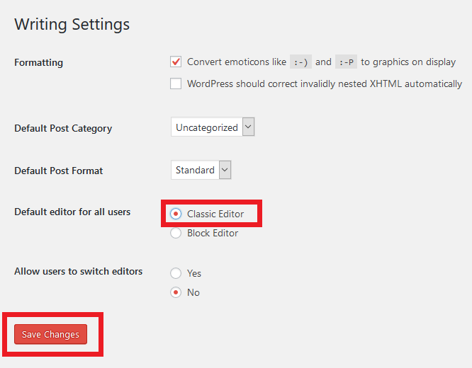

#### If your WordPress editor is configured as a Block editor by default, you can switch it back to the old Classic editor. To do so, go to **Dashboard**, then hover over **Settings** and select **Writing**.

#### Switch to **Classic Editor** in the "Default editor for all users" section.

#### Click the **Save Changes** button.
