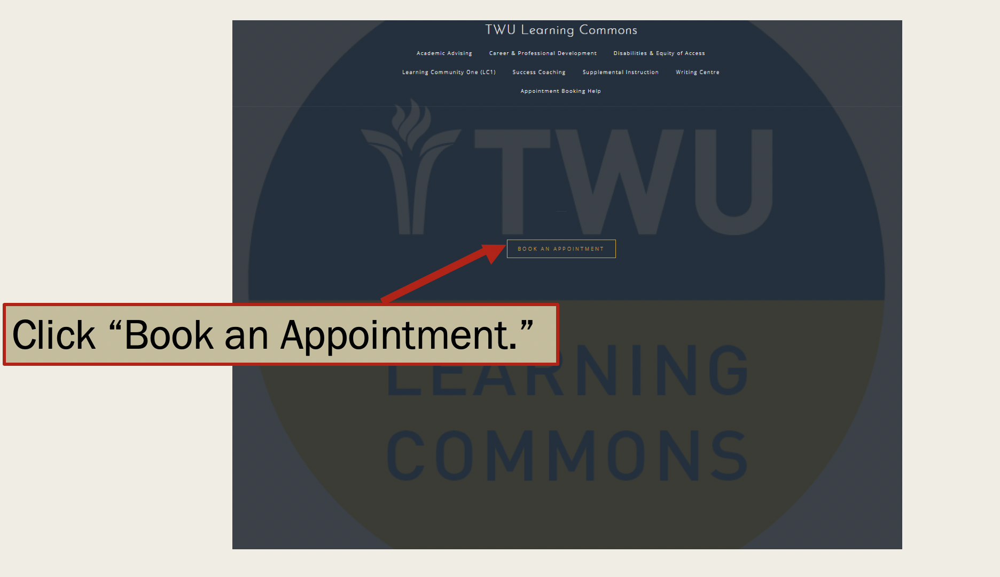
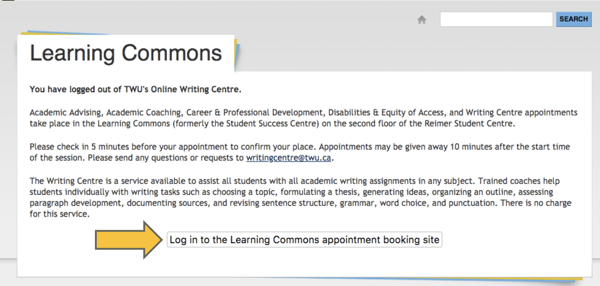
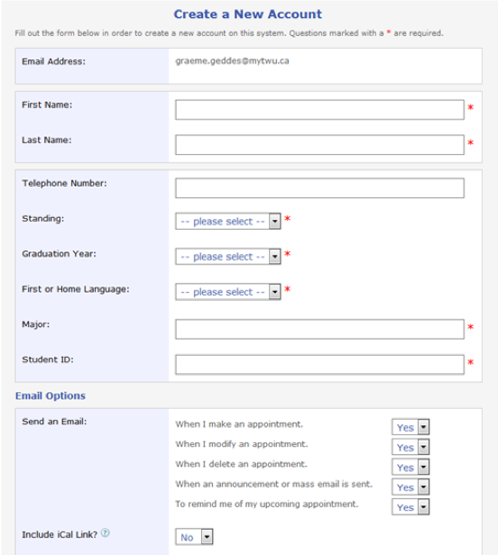
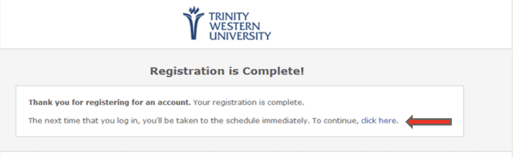
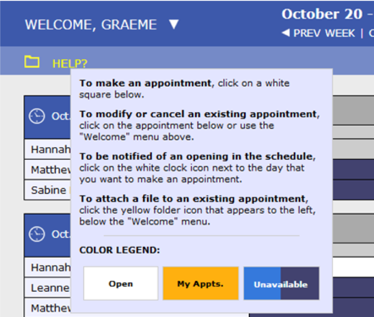
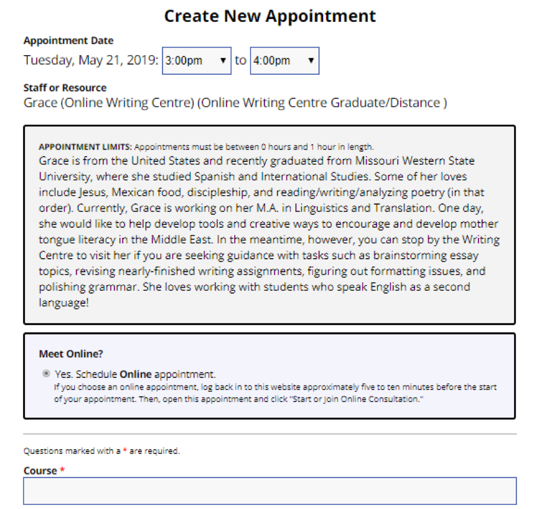
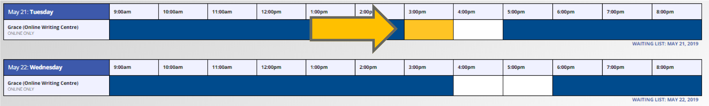
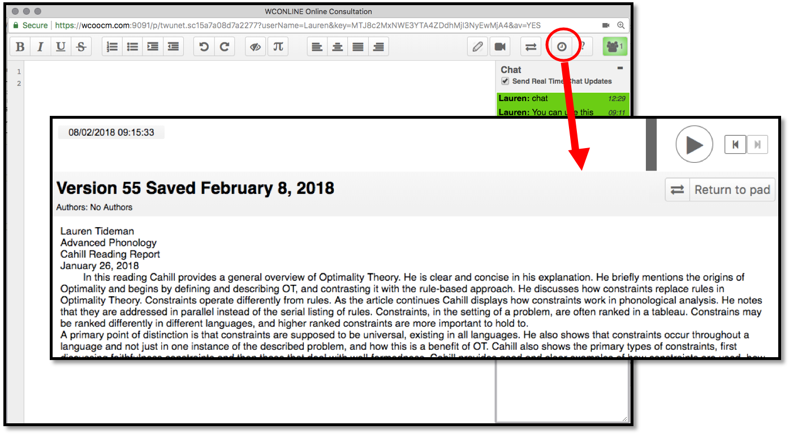

- Undergraduate:
  - Online Writing Sessions, live video conferencing sessions
  - WriteAway.ca, Online Writing Support, writing feedback within 48 hours    

- Graduate:
Online Writing Sessions, live video conferencing sessions

### Online Writing sessions

To book online writing sessions, visit [twu.ca/writing](twu.ca/writing) or [create.twu.ca/learningcommons](create.twu.ca/learningcommons)

### Log in with your TWU Pass

### Create an account

To access the appointment booking system, you will need to register your account the first time you log into the system. All accounts are tied to your mytwu.ca email accounts.  

 

### After this registration form, a confirmation page will pop up. Go through the “click here” link to access the schedule.

### Book an appointment

### If you need help, hover over the HELP? tab in the top left corner.

### Select the **Online Writing Centre** calendar.

### Fill out the appointment form.(Sessions are for one hour.)  

### When it is time for your session, open the yellow appointment box.  

### Click on **START OR JOIN ONLINE CONSULTATION**.  

### The online platform will open. Audio and video work best using **FireFox** or **Google Chrome**.

### You can import and export your assignment into the shared whiteboard.

### The site records the session. After the session you can click on the clock icon to replay the session.

---

### Questions?

Contact:

    Emily Keery
    Writing Centre Coordinator
    writingcentre@twu.ca      
    emily.keery@twu.ca
