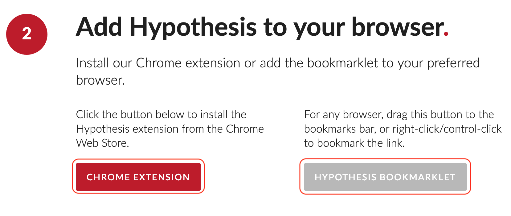
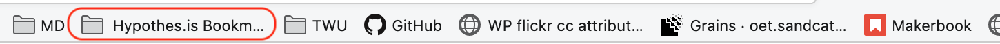
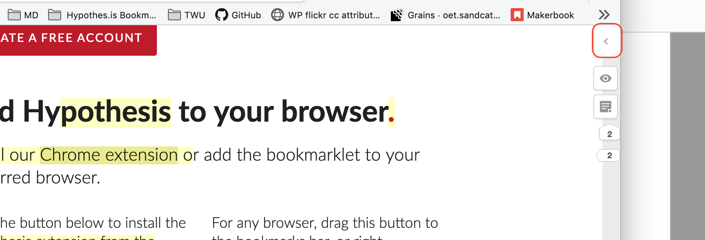
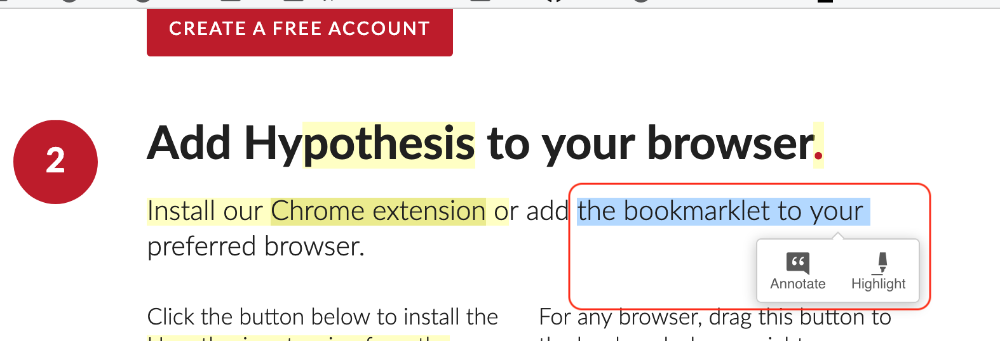

Hypothes.is is a very light-weight web service and browser extension that you can easily install in your own browser and then use to have conversations *in situ* on web documents such as blogs, articles, documents, websites, and other resources.

#### Sign up for hypothes.is. It’s free and easy.

##### Go to [hypothes.is/start](https://hypothes.is/start) and click 'Create a Free Account'

##### Enter a username, email address (this does not have to be your TWU address), and password.
##### Click the checkbox to indicate that you agree to the linked policies.
!! ...or don't, but then you won't be able to use hypothes.is. If you would like to protect your identity online, you may choose a pseudonym rather than your real name, or speak with your instructor about an alternative assignment.

##### Click 'Sign up'.

#### Add hypothes.is to your browser.

- If you use Chrome as your web browser, click the 'Chrome Extension' button. If you use Firefox or Safari, bookmark the 'Hypothesis Bookmarklet' by dragging it to your bookmarks bar, or right-click to bookmark the link.
- If you use Internet Explorer or Edge, download Firefox or Safari and use one of those instead. [Hypothes.is will probably work in IE or Edge, but those browsers are ... stale, at best!]

#### Start Annotating

##### Go to any webpage and launch the bookmarklet by clicking on it in your bookmarks bar.

##### Click the arrow in the top, right corner of your browser window to open the overlay.

##### Sign in to the bookmarklet.

##### Select any text on the webpage, and click 'Annotate'.

##### Enter your comment.
- If your group is using a common tag, enter it in the 'Add tags' text area. Tags can be useful to filter annotations.

##### Click 'Post to Public' to save your comment.

!! Yes, your annotation is public. It is visible to anyone who has the hypothes.is bookmarklet active in their browser, and it is released under a [Public Domain license](https://creativecommons.org/share-your-work/public-domain/).

##### Click the arrow to reply to another annotation.

Happy annotating! See you on the web!

!!! [Click here if you'd like to learn more about using Hypothes.is in your class room.](https://web.hypothes.is/education/)
