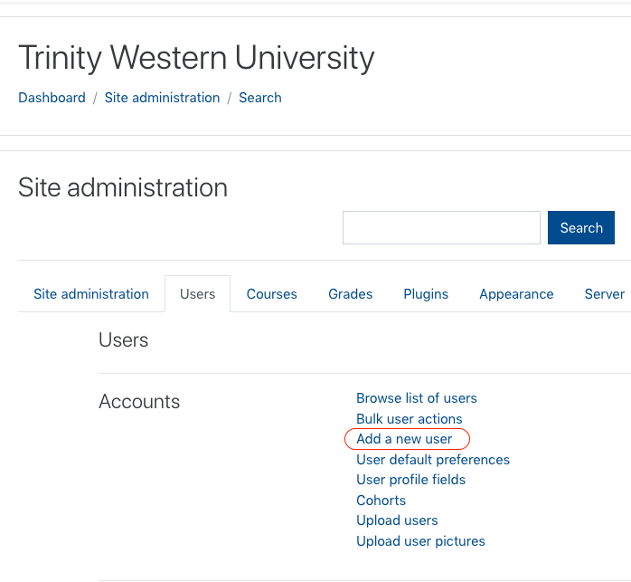
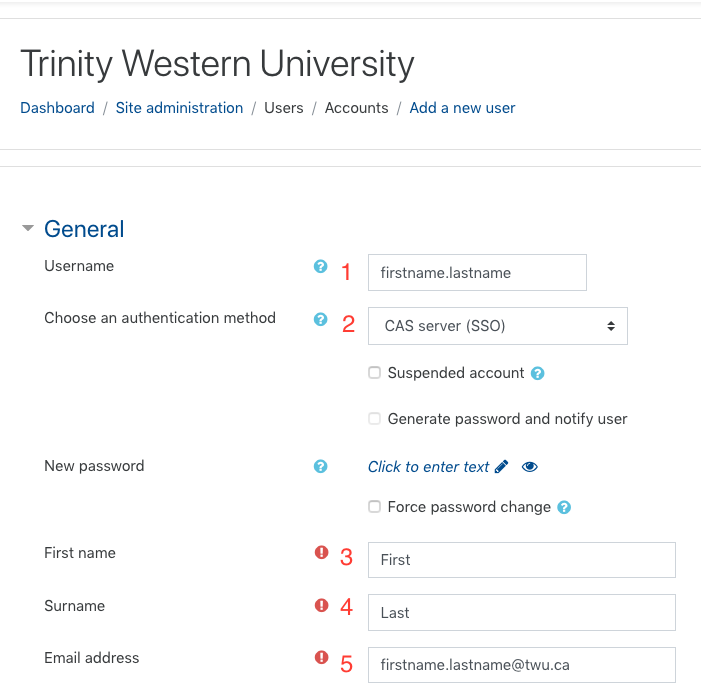

We may manually create **STAFF** accounts in Moodle for users who need access to Moodle but who are not automatically enrolled in Moodle courses. Examples include:
- clinical supervisors for Nursing
- new faculty assistants
- learning coaches

!! You can tell if it is a staff member if their email address is firstname.lastname@TWU.ca instead of firstname.lastname@MYtwu.ca.

Requests for new manual accounts should be from faculty assistants, Deans' Executive Assistants, Deans, Program Directors, or other administrators.

We *rarely* create accounts for people who do not have a TWU Pass account. If we do, it needs to be approved by the Manager of Online Learning.

We do not create manual accounts for students.

### Click 'Site Administration > Users > Add a new user'

### Enter the following information:

1. The person's TWU Pass username as it is in their TWU email address.
2. Set the authentication method to 'CAS Server (SSO)'.
3. First name.
4. Last name.
5. TWU email address.

If the person does not yet have a TWU email address, that will need to be completed prior to proceeding.

### Click 'Optional' and enter their ID number if available.

### Click 'Create user'.
